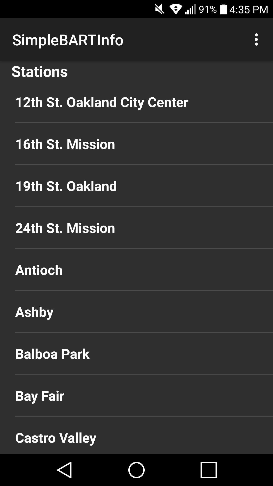

# Simple BART Information Application

## This is a very basic BART application
### Default view is the bart stations list which allows you to pick a station and see when the next trains will be coming
### Has a fare calculator, but the youth fares are commendted out, but easy to add in if you need it
### Has map of bart, with primitive zoom, but buggy (TODO / FIXME)
### Also shows the BART alerts, so you can see when BART is having issues.
### Has a basic trip planner 

## Requires Android API level 24 or Android 7

Station List

Fare Estimator

Trip Planner

